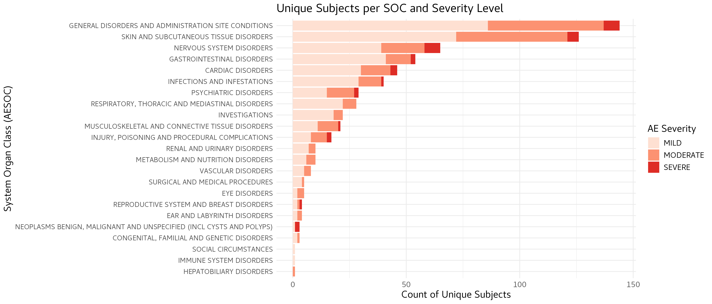

# RVA Assessment

This repository contains solutions for three R-based assessment tasks using clinical adverse event data from `pharmaverseadam`.

## Assessment Summary

This project delivers:

- A TEAE summary table suitable for regulatory-style reporting
- A publication-quality adverse event severity figure
- An interactive Shiny dashboard for treatment-arm exploration

Technical approach:

- Built in R with `tidyverse`-based data prep
- Uses subject-level deduplication to avoid overcounting
- Produces reproducible outputs directly from packaged example data

## Repository Structure

```text
RVA_Assessment/
├── docs/
│   └── TEAE_Summary.html
├── question_1/
│   ├── question_1.R
│   └── TEAE_Summary.html
├── question_2/
│   ├── question_2.R
│   └── AE_Severity_Distribution.png
├── question_3/
│   └── question_3.R
└── README.md
```

## Requirements

- R (>= 4.2 recommended)
- Packages:
  - `tidyverse`
  - `dplyr`
  - `ggplot2`
  - `gtsummary`
  - `gt`
  - `shiny`
  - `pharmaverseadam`

Install dependencies in R:

```r
install.packages(c("tidyverse", "dplyr", "ggplot2", "gtsummary", "gt", "shiny"))
install.packages("pharmaverseadam")
```

## Tasks and Outputs

### Question 1: TEAE Summary Table

Script: `question_1/question_1.R`

Goal:

- Create a clear, hierarchical TEAE incidence summary by treatment arm

Implementation:

- Loads `adae` and `adsl` from `pharmaverseadam`
- Filters treatment-emergent adverse events (`TRTEMFL == "Y"`)
- Builds a hierarchical summary table:
  - Any TEAE
  - System Organ Class (SOC)
  - Preferred Term (PT)
- Merges against ADSL-derived subject lists to preserve denominators
- Formats output using `gtsummary`/`gt`

Run:

```bash
Rscript question_1/question_1.R
```

Outputs:

- `question_1/TEAE_Summary.html`
- `docs/TEAE_Summary.html` (GitHub Pages artifact)

View the interactive HTML table here:

[Open TEAE Summary Table](https://rosscm.github.io/RVA_Assessment/TEAE_Summary.html)

### Question 2: AE Severity Visualization

Script: `question_2/question_2.R`

Goal:

- Provide an interpretable visual summary of AE burden and severity distribution

Implementation:

- Filters TEAEs and deduplicates by subject/SOC/severity
- Counts unique subjects by SOC and severity (`AESEV`)
- Orders SOCs by total burden for easier scanning
- Generates a stacked horizontal bar chart with severity-based fill

Run:

```bash
Rscript question_2/question_2.R
```

Output:

- `question_2/AE_Severity_Distribution.png`



### Question 3: Interactive Shiny Dashboard

Script: `question_3/question_3.R`

Goal:

- Make the severity distribution explorable by treatment arm

Implementation:

- Prepares TEAE severity summary by treatment arm
- Launches a Shiny app with treatment-arm filtering
- Displays an interactive severity distribution plot

Run:

```bash
Rscript question_3/question_3.R
```

Then open the local Shiny URL shown in your R console (typically `http://127.0.0.1:xxxx`).

## Notes

- Scripts use packaged example datasets (`pharmaverseadam`) and do not require external data files.
- Run commands from the repository root (`RVA_Assessment`) so output paths resolve correctly.
- The workflow is intentionally modular so each deliverable can be reviewed independently.
